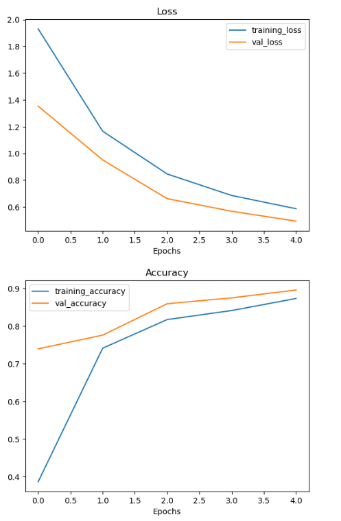
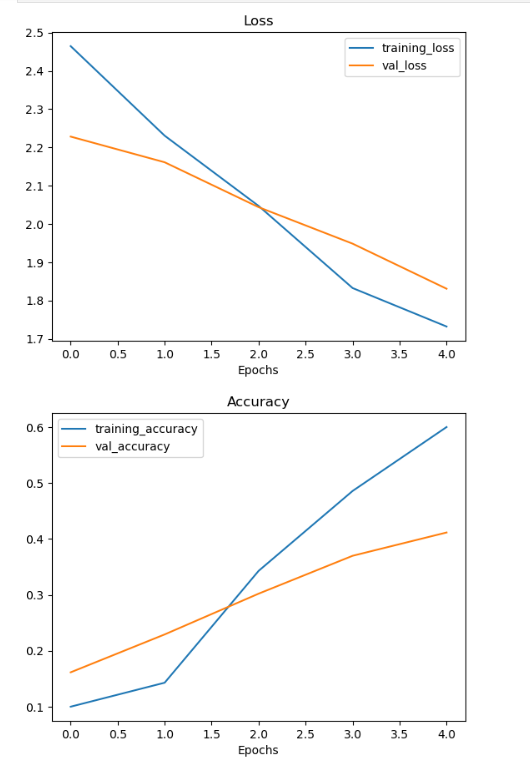
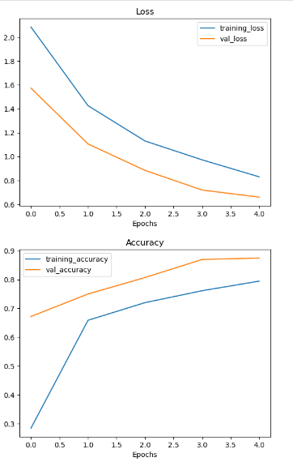
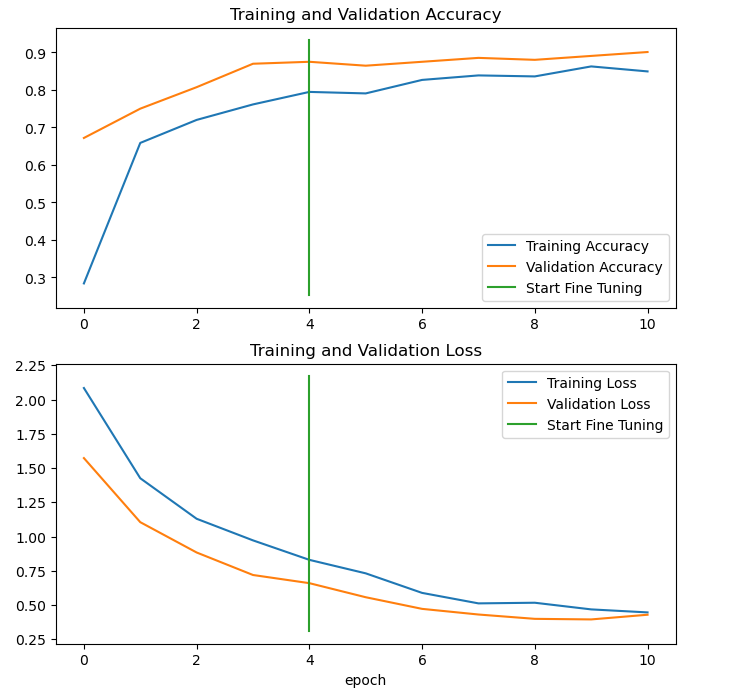
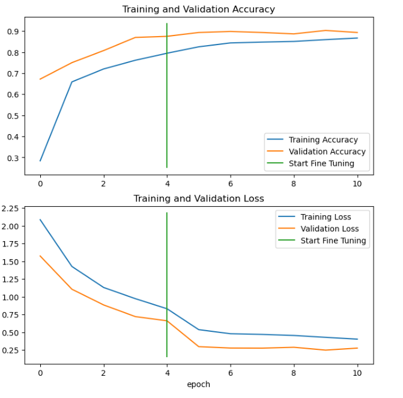

---
# Food Vision Fine-tuning Project
---

The "Food Vision Fine-tuning Project" focuses on applying the "fine-tuning" technique in the field of computer vision. The main goal of fine-tuning is to adapt a pretrained model to a specific dataset, which typically leads to better results in tasks such as image classification.

## Transfer Learning Models

The project utilizes transfer learning models (EfficientNetV2B0), pretrained on large and diverse datasets. Initially, features are extracted from these models for specific food classes through feature extraction. Different percentages of training data are then used to explore various scenarios:

- **Model 0**: Includes a base model with frozen layers to prevent changes to pretrained patterns. This model is used for feature extraction.

- **Model 1** and **Model 2**: Use smaller percentages of training data (e.g., 1% and 10%) with data augmentation. These models focus on speeding up iterations and determining optimal parameters without large volumes of data.

- **Model 3** and **Model 4**: Fine-tuning models that involve unlocking some of the frozen layers of the base model. This allows the model to adjust its parameters during training on the specific dataset.

## Results

Results from different experiments are evaluated using metrics such as training and validation accuracy and loss. Each step contributes to understanding how the model performs based on the data volume and degree of fine-tuning.

### Model 0

Model 0 achieved the following results after five epochs of training:

- Training Accuracy: **87.33%**
- Training Loss: **0.5874**
- Validation Accuracy: **89.58%**
- Validation Loss: **0.4950**

These metrics indicate that the model has good accuracy and low loss in both training and validation. The higher validation accuracy (89.58%) compared to training accuracy (87.33%) suggests that the model does not overfit when trained on this data.

### Model 1:

Model 1 achieved the following results after five epochs of training:

- Training Accuracy: **60.00%**
- Training Loss: **1.7319**
- Validation Accuracy: **41.15%**
- Validation Loss: **1.8307**

Model 1 uses only 1% of the data for training with data augmentation. The low validation accuracy (41.15%) indicates that the model may have encountered overfitting issues, struggling to generalize the extracted features.

### Model 2:

Model 2 achieved the following results after five epochs of training:

- Training Accuracy: **79.47%**
- Training Loss: **0.8303**
- Validation Accuracy: **87.50%**
- Validation Loss: **0.6602**

Model 2 uses 10% of the data for training with data augmentation. Despite relatively low training accuracy, the model achieves better validation accuracy (87.50%), indicating improved generalization compared to the model with less data.

### Model 3:

Model 3 achieved the following results after ten epochs of training:

- Training Accuracy: **84.93%**
- Training Loss: **0.4467**
- Validation Accuracy: **90.10%**
- Validation Loss: **0.4298**

Model 3 represents fine-tuning of Model 2 on 10% of the data with the last 10 layers unfrozen. The validation accuracy of 90.10% shows that the fine-tuning process helped the model adapt better to the specific data characteristics.

### Model 4:

Model 4 achieved the following results after ten epochs of training:

- Training Accuracy: **86.69%**
- Training Loss: **0.4017**
- Validation Accuracy: **89.31%**
- Validation Loss: **0.2754**

Model 4 represents fine-tuning of Model 2 on the entire training dataset (100%). The validation accuracy of 89.31% demonstrates that fine-tuning with more data leads to better results.

## Training Analysis Plots

### Model 0: 

### Model 1:

### Model 2:

### Model 3:

### Model 4:

# Contact

For questions or additional information, please contact at:

Email: radi2035@gmail.com
